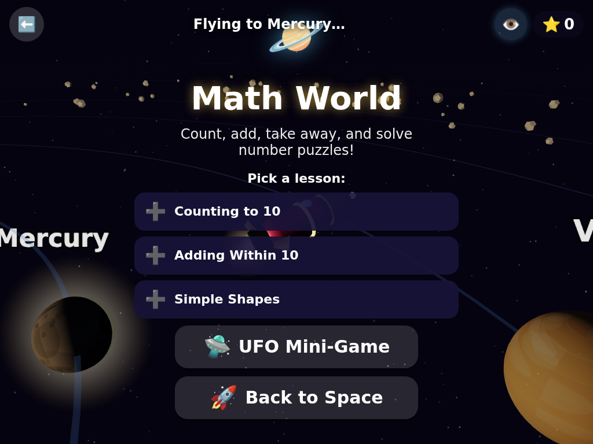
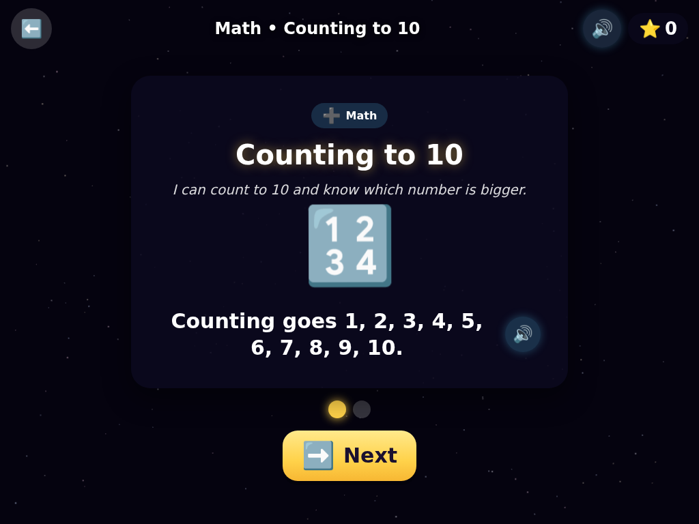
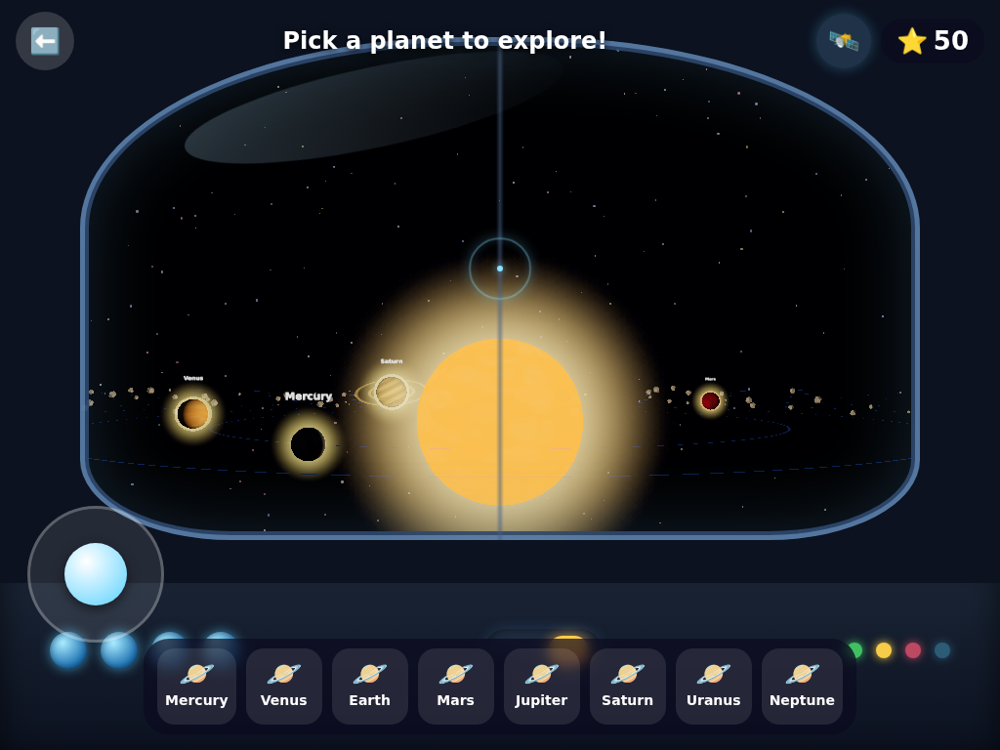
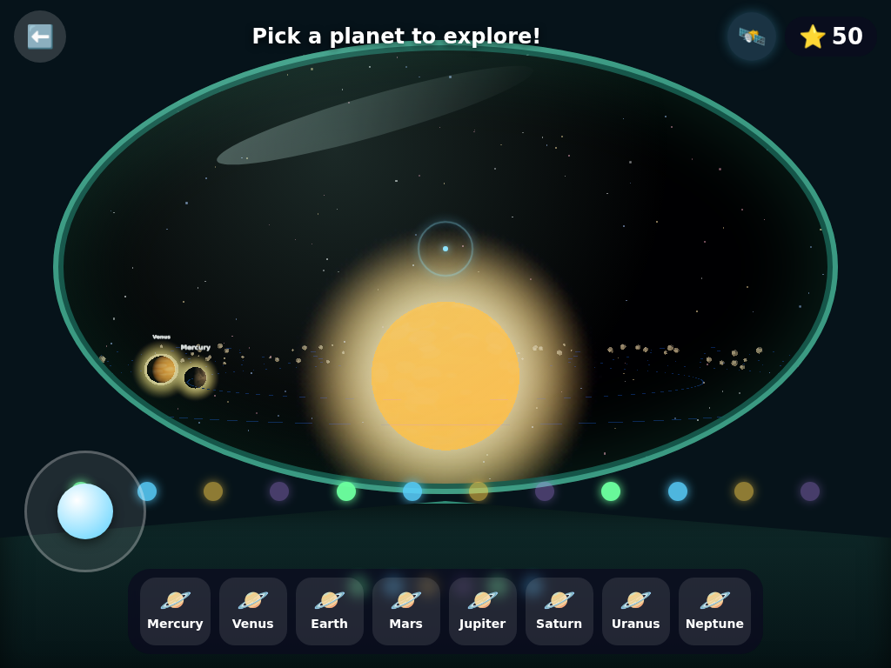
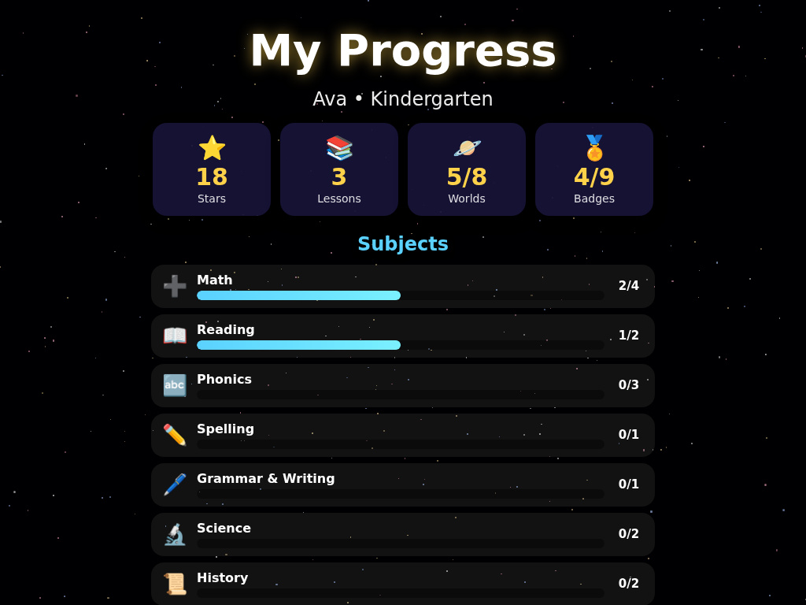

# 🚀 Space Explorer Academy

A gorgeous, touch-first **3D educational space game** for kids **toddler through 3rd grade**.
Kids choose a rocket and fly a 3D solar system where **each planet is a school
subject world**. They land to take real **lessons** — a short, illustrated
explanation followed by practice — across the full elementary curriculum, and
play shooting mini-games, earning stars, unlocking planets, and collecting badges.

### The curriculum (each planet is a subject world)

| Planet | Subject world | Sample lessons |
|---|---|---|
| Mercury | **Math** | Counting, Sorting, Add/Subtract, Place value, Time, Money, Multiplication, Division, Fractions |
| Venus | **Phonics** | Alphabet, Beginning/letter sounds, Rhyming, Short vowels, Blending, Digraphs, Silent E, Bossy R |
| Earth | **Reading** | Sight words, Directions, Characters & setting, Sequencing, Predictions, Main idea, Context clues, Fact vs. opinion |
| Mars | **Science** | Body & senses, Living things, Animal needs, Plants, Seasons, Matter, Forces & magnets, Water cycle, Life cycles, Habitats, Solar system |
| Jupiter | **Social Studies** | Then & now, Families, Community helpers, Holidays, American symbols, Inventors, Maps & directions, Landforms, Continents, USA & capitals |
| Saturn | **Spelling** | Short words, Sight words, Blends, Plurals, Double letters, Silent letters, Compound words, Contractions |
| Uranus | **Grammar & Writing** | Nouns, Verbs, Pronouns, Adjectives, Past tense, Conjunctions, Capitals, Commas |
| Neptune | **Arts, Music & Health** | Colors & mixing, Shapes & lines, Famous artists, High/low, Rhythm, Notes, Foods, Feelings, Safety, Hygiene |

Every lesson **teaches first, then quizzes** — content is grade-leveled
(toddler → 3rd). **Pre-readers can play solo:** every lesson, question, and
instruction is **read aloud** (on-device speech, no internet needed), with
picture/emoji answers and a tap-to-hear 🔊 button on each card.

Built with **Three.js + Vite + TypeScript**. Tablet/touch-first, with full mouse
& keyboard support. Visuals are almost entirely **procedural** (shaders, particles,
canvas textures, primitive-geometry rockets) — no large binary assets, no
licensing concerns.

## Screenshots

| | |
|---|---|
| **Title** | **Choose your grade** |
|  |  |
| **Choose your rocket** | **Explore the full solar system** |
|  |  |
| **Pick a lesson (subject world)** | **Learn, then practice** |
|  |  |
| **Practice questions** | **UFO mini-game (inner planets)** |
|  |  |
| **Saturn & its rings** | **Asteroid Blast (outer planets)** |
|  |  |
| **First-person rocket cockpit** | **First-person UFO dome** |
|  |  |
| **Progress & parent dashboard** | |
|  | |
| **Earn stars & badges** | |
|  | |

## Getting started

```bash
npm install
npm run dev      # dev server at http://localhost:5173 (use the Network URL on a tablet)
npm run build    # type-check + production bundle to dist/
npm run preview  # serve the production build
```

## How to play

1. **Start Adventure** → pick your **grade** (sets question difficulty) → choose one
   of **3 rockets**.
2. In the **solar system**, free-fly with the on-screen joystick (or WASD/arrows),
   or tap a planet / its dock button to **auto-travel** there. Tap the **👁️ button**
   to switch into a **first-person cockpit** view — a rocket flight deck or a UFO
   glass dome, matched to your chosen ship.
3. Each planet is a **subject world**. Pick a **lesson** to learn a concept
   (illustrated teaching cards) and then practice it, or play the **mini-game**
   (UFO shooter at the inner planets, Asteroid Blast at the outer ones).
4. Earn **⭐ stars** for correct answers — they unlock new planets and earn **badges**.
   Progress saves automatically to your browser.

Pre-readers are fully covered: **everything is read aloud** automatically, each
card has a 🔊 replay button, and a **Read Aloud** toggle (on the title screen and
in the HUD) turns narration on/off. Answers also come in **picture/emoji** form.

## Project layout

```
data/curriculum/<subject>.json   # lessons (teach + practice) per subject — easy to edit
src/core/        # Game spine, loop, state machine, event bus
src/states/      # screens: start, grade/rocket select, solar system, lesson, UFO, reward
src/scene/       # Three.js: renderer, bloom, starfield, planets, rocket, UFOs, particles
src/curriculum/  # schema + JSON loader/validator + question picker
src/player/      # profile + localStorage persistence
src/progression/ # stars, planet unlocks, badges
src/ui/          # DOM overlay: HUD, buttons, question/teach cards, cockpit, toasts
src/input/       # unified touch + mouse/keyboard intents, virtual joystick
```

## Adding curriculum content

Each subject has one file, `data/curriculum/<subject>.json`, containing a list
of **lessons**. A lesson has a `gradeBand`, a `title`, an "I can…" `objective`,
`teach` cards (the explanation), and `questions` (the practice):

```jsonc
{
  "id": "math-k-add10", "gradeBand": "k", "title": "Adding Within 10",
  "objective": "I can add two numbers that make 10 or less.",
  "teach": [ { "text": "Adding puts groups together.", "image": "➕" } ],
  "questions": [
    { "id": "q1", "prompt": "What is 2 + 1?", "answerStyle": "number",
      "answers": [ {"id":"a","label":"3","correct":true}, {"id":"b","label":"2","correct":false} ] }
  ]
}
```

Everything is validated at load time against `src/curriculum/types.ts`; bad
entries are logged and skipped. Grade bands: `toddler, prek, k, g1, g2, g3`.
Answer styles: `text`, `number`, `picture` (emoji). Which subjects appear on
which planet is set in `src/config/planets.ts`.

## Roadmap

- **Phase 1 (done):** polished vertical slice — onboarding, inner solar system,
  flight, quizzes (math/phonics/science/geography & more), UFO mini-game, stars,
  unlocks, badges, persistence.
- **Phase 3 (done):** full solar system — Jupiter, Saturn (with rings!), Uranus,
  Neptune with per-type gorgeous textures, atmospheric glow, an asteroid belt,
  extended unlock progression, and the Asteroid Blast mini-game variant.
- **Phase 2 (done):** broadened curriculum across grade bands.
- **Curriculum overhaul (done):** real **lessons** (teach then practice) across
  the whole elementary curriculum — Math, Reading, Phonics, Spelling, Grammar,
  Science, Social Studies (History & Geography), and Arts/Music/Health. Each
  planet is now a coherent **subject world** (132 lessons / 411 practice items,
  with at least one lesson per subject at every grade band toddler → 3rd).
- **First-person cockpit (done):** rocket flight deck & UFO dome views.
- **Phase 4 (done):** spoken narration — lessons, questions, and instructions
  are read aloud on-device (Web Speech API, no assets), with per-card 🔊 replay
  and a Read Aloud toggle, so pre-readers can play independently.
- **Phase 5 (in progress):** **Progress & parent dashboard** — overall stats
  (stars, lessons, worlds unlocked, badges), per-subject progress bars for the
  child's grade, a badge trophy shelf, and settings (Read Aloud, Sound, **Music**,
  Change Grade, Reset Progress). Next: content-authoring tools.
- **Gentle space music (done):** a calm, procedural ambient soundtrack — a
  breathing chord pad under sparse pentatonic "twinkles", synthesized live with
  the Web Audio API (no assets), with an on/off toggle.
