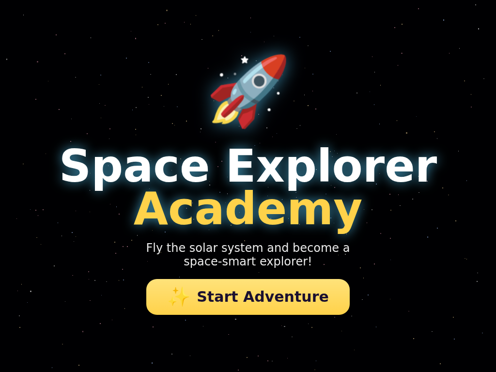
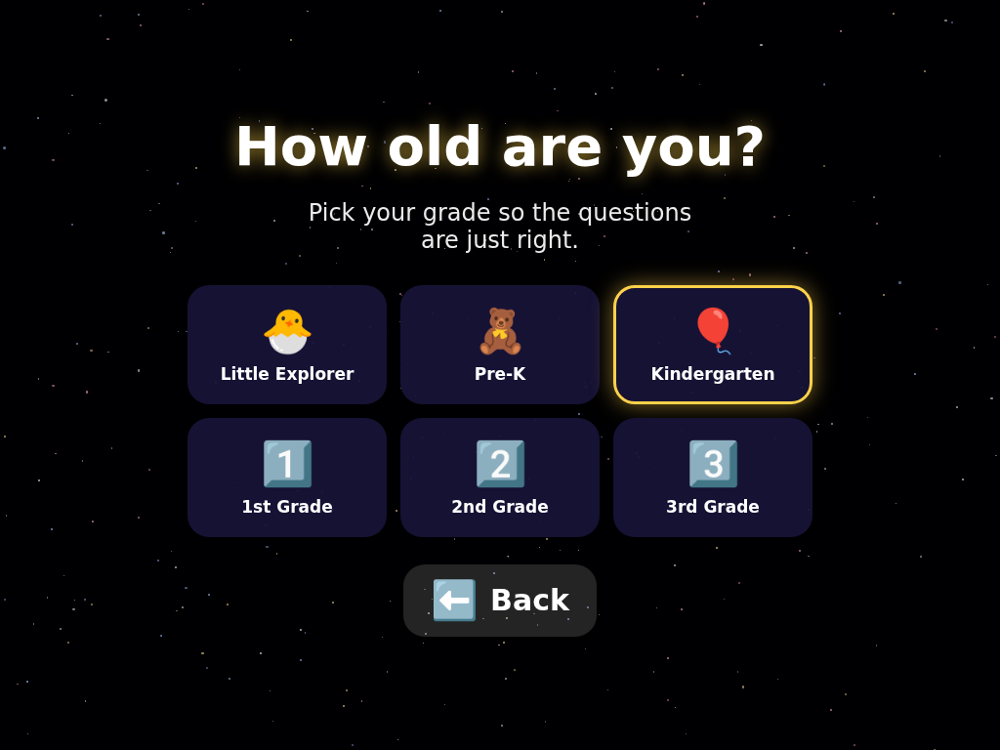
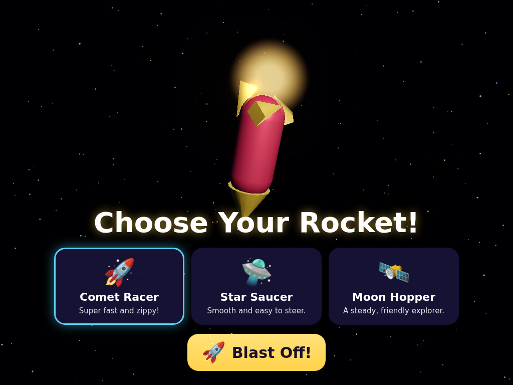
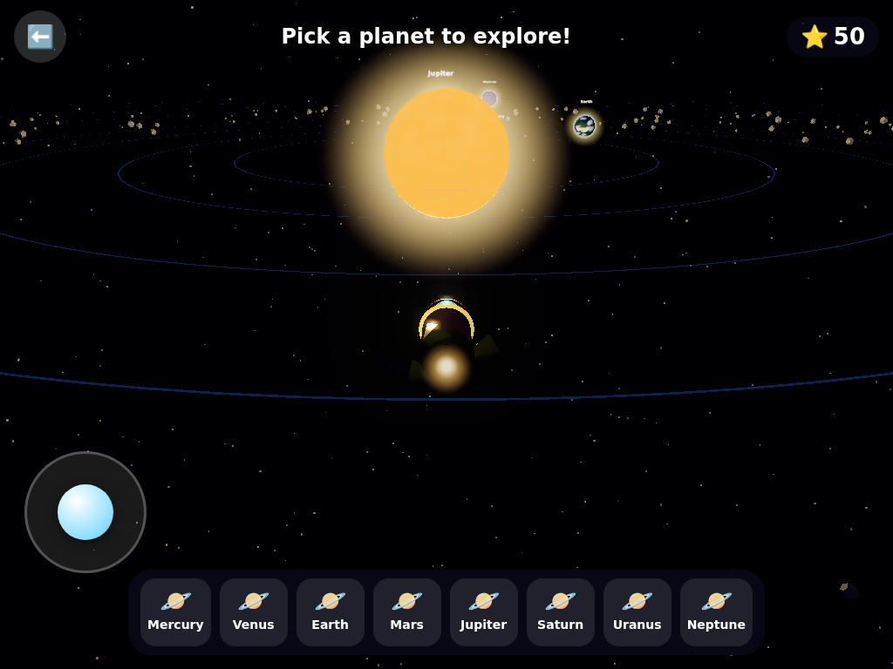
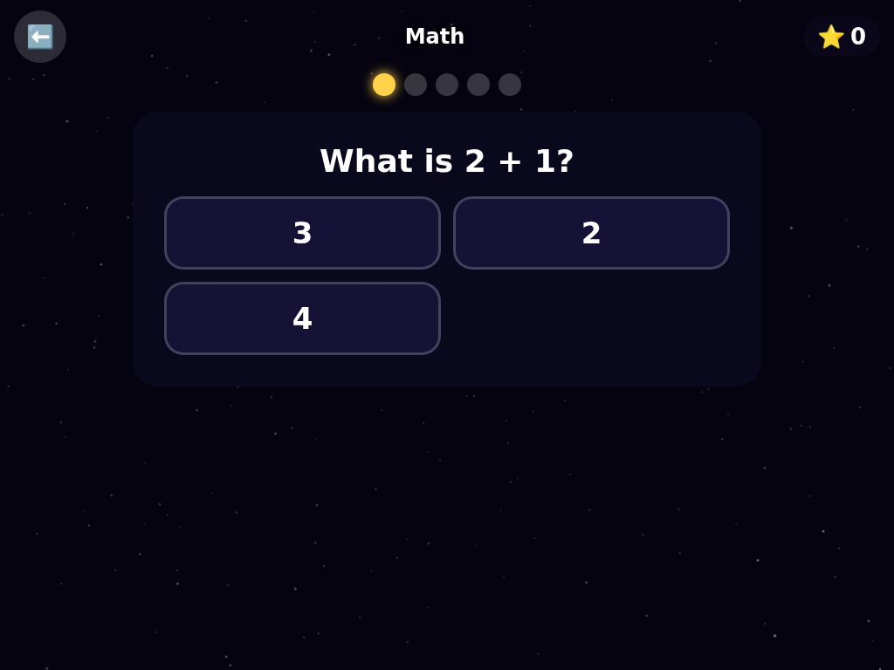
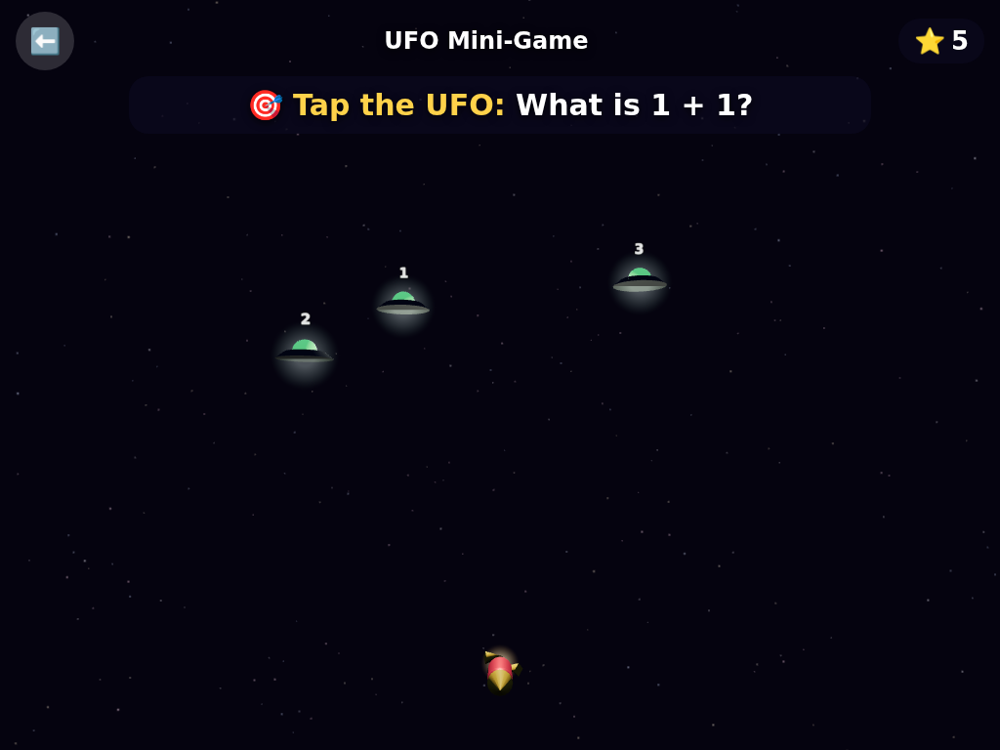
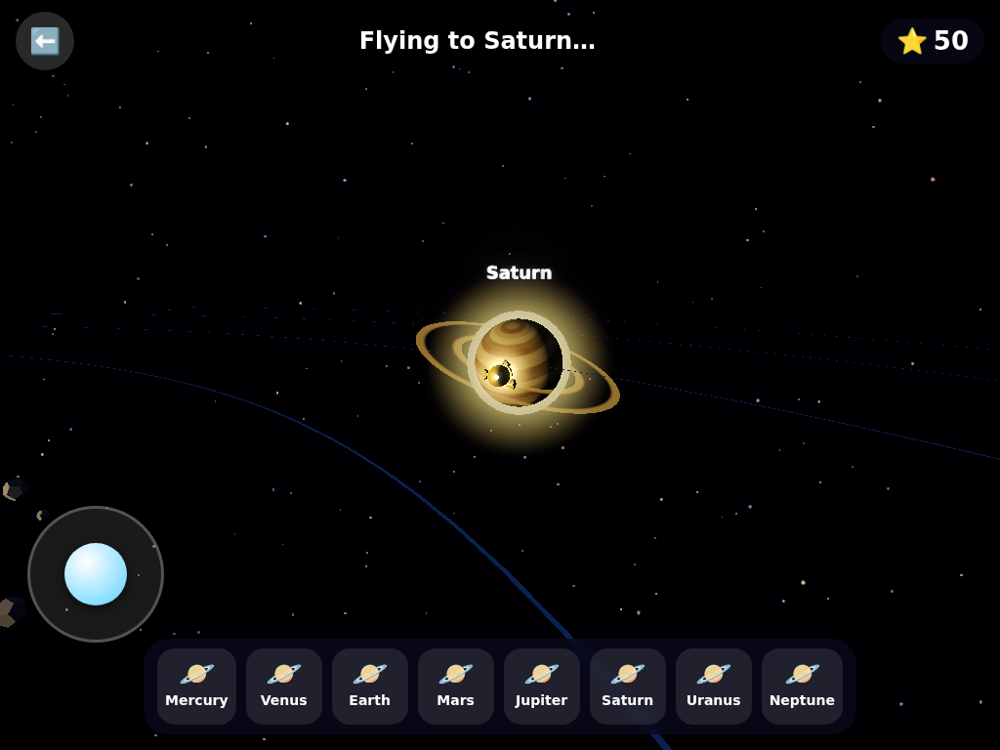
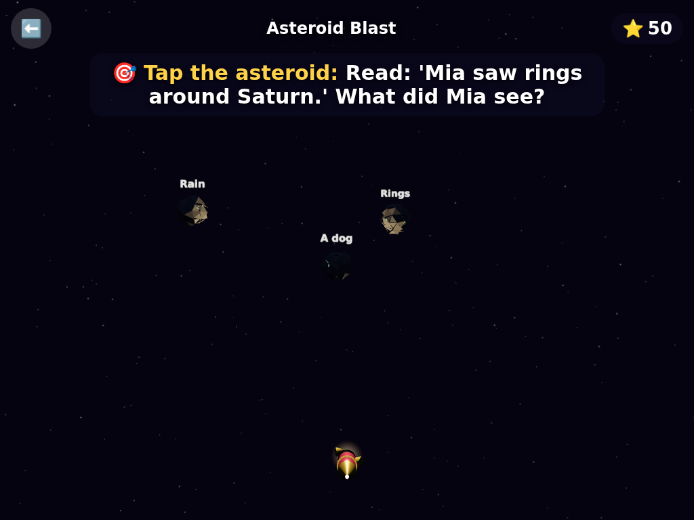
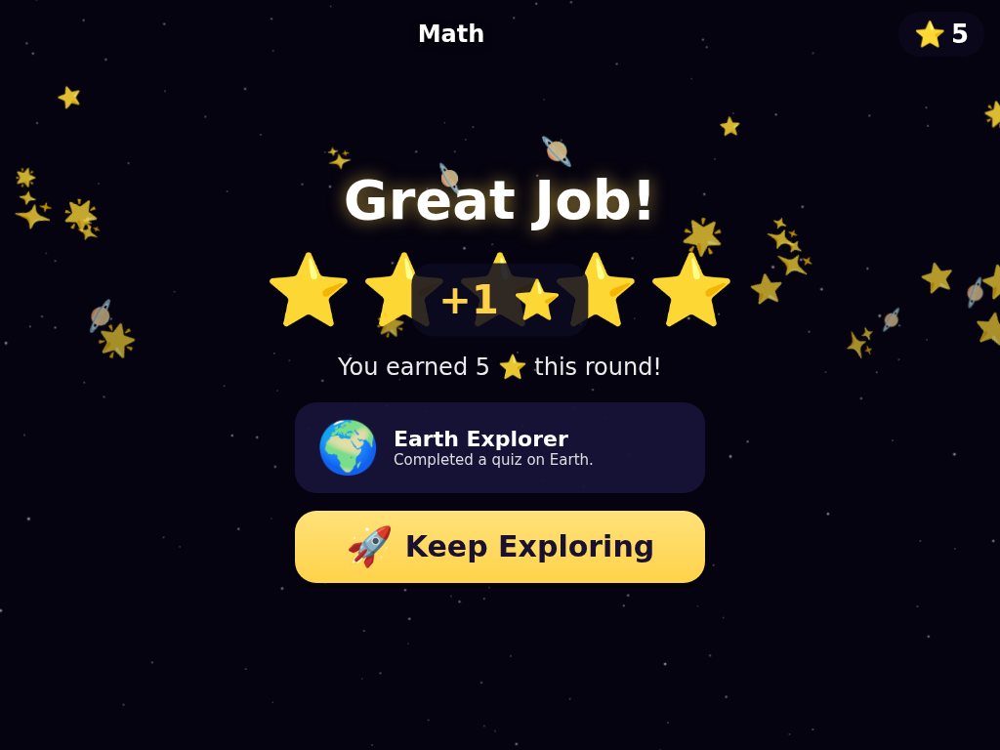

# 🚀 Space Explorer Academy

A gorgeous, touch-first **3D educational space game** for kids **toddler through 3rd grade**.
Kids choose a rocket, fly a 3D solar system, land on planets to answer
age-appropriate questions across a full school curriculum, and play UFO-shooting
mini-games — earning stars, unlocking planets, and collecting badges.

Built with **Three.js + Vite + TypeScript**. Tablet/touch-first, with full mouse
& keyboard support. Visuals are almost entirely **procedural** (shaders, particles,
canvas textures, primitive-geometry rockets) — no large binary assets, no
licensing concerns.

## Screenshots

| | |
|---|---|
| **Title** | **Choose your grade** |
|  |  |
| **Choose your rocket** | **Explore the full solar system** |
|  |  |
| **Answer questions** | **UFO mini-game (inner planets)** |
|  |  |
| **Saturn & its rings** | **Asteroid Blast (outer planets)** |
|  |  |
| **Earn stars & badges** | |
|  | |

## Getting started

```bash
npm install
npm run dev      # dev server at http://localhost:5173 (use the Network URL on a tablet)
npm run build    # type-check + production bundle to dist/
npm run preview  # serve the production build
```

## How to play

1. **Start Adventure** → pick your **grade** (sets question difficulty) → choose one
   of **3 rockets**.
2. In the **solar system**, free-fly with the on-screen joystick (or WASD/arrows),
   or tap a planet / its dock button to **auto-travel** there.
3. At a planet, pick a **subject** to start a quiz, or play the **UFO mini-game**.
4. Earn **⭐ stars** for correct answers — they unlock new planets and earn **badges**.
   Progress saves automatically to your browser.

Pre-readers are covered with **picture/emoji answers**; spoken narration is a
planned later phase.

## Project layout

```
data/curriculum/<planet>/<subject>.json   # all questions — easy to edit & expand
src/core/        # Game spine, loop, state machine, event bus
src/states/      # screens: start, grade/rocket select, solar system, quiz, UFO, reward
src/scene/       # Three.js: renderer, bloom, starfield, planets, rocket, UFOs, particles
src/curriculum/  # schema + JSON loader/validator + question picker
src/player/      # profile + localStorage persistence
src/progression/ # stars, planet unlocks, badges
src/ui/          # DOM overlay: HUD, buttons, question cards, toasts
src/input/       # unified touch + mouse/keyboard intents, virtual joystick
```

## Adding curriculum content

Add or edit JSON files under `data/curriculum/<planet>/<subject>.json`. Each
question is validated at load time against the schema in
`src/curriculum/types.ts`; bad entries are logged and skipped. Grade bands:
`toddler, prek, k, g1, g2, g3`. Answer styles: `text`, `number`, `picture`
(emoji). Register new `(planet, subject)` files in
`data/curriculum/index.json`.

## Roadmap

- **Phase 1 (done):** polished vertical slice — onboarding, inner solar system,
  flight, quizzes (math/phonics/science/geography & more), UFO mini-game, stars,
  unlocks, badges, persistence.
- **Phase 3 (done):** full solar system — Jupiter, Saturn (with rings!), Uranus,
  Neptune with per-type gorgeous textures, atmospheric glow, an asteroid belt,
  extended unlock progression, and the Asteroid Blast mini-game variant.
- **Phase 2 (done):** broadened curriculum — reading added, plus math, science,
  spelling and reading content for the outer planets across grade bands.
- **Phase 4 (next):** spoken narration & richer audio for pre-readers.
- **Phase 5:** content-authoring tools & parent dashboard.
